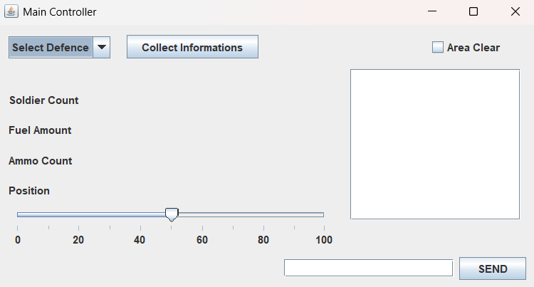

# 🛡 Defence System

**Author:** Shameel Shajaad  
**Module:** Object-Oriented Programming (ICET Institute)  
**Language:** Java  

---

## 📝 Description
**Defence System** is a **Java Swing-based multi-unit defence control system** developed for the **OOP module** at **ICET Institute**.  

This project demonstrates **real-time control and communication** between a **Main Controller** and multiple defence units (Helicopter, Tank, Submarine) using the **Observer design pattern**. Each unit has its own window with interactive controls, resource management, and operation buttons.  

> 💻 Built using **NetBeans IDE** for GUI design and project management.  

---

## ⚡ Features

1. **Multi-Unit Defence Control**
   - Main Controller coordinates **Helicopter, Tank, and Submarine** units.
   - Sends messages and updates unit positions in real-time.

2. **Resource Management**
   - Each unit has **soldier count, ammo, fuel, and oxygen (for Submarine)**.
   - Resources **decrease automatically over time** via timers.
   - Pop-up alerts when fuel or oxygen drops below thresholds.
   - Refill options available directly from the GUI.

3. **Dynamic Operations**
   - Units perform actions such as **shooting, missile launches, laser/sonar operations**.
   - Buttons are enabled/disabled based on **unit position or available resources**.
   - Real-time updates from the Main Controller ensure all units reflect the current state.

4. **Interactive Messaging**
   - Units can send messages to the Main Controller and receive feedback instantly.
   - Main Controller can broadcast commands and status updates.

5. **Graphical User Interface (GUI)**
   - Built using **Java Swing**
   - Each unit has **dedicated windows** with sliders, spinners, labels, and buttons.
   - Main Controller centralizes control with real-time monitoring.

6. **Object-Oriented Design**
   - **Encapsulation:** Units maintain their internal state securely (ammo, fuel, position).  
   - **Polymorphism:** `DefenceSystemObserver` interface allows all units to implement common methods.  
   - **Observer Pattern:** `DefenceSystemObservable` notifies all observers (units) about position changes and area clear events.  
   - **Modular Classes:** Clear separation between **MainController, Defence Units, and Observable System**.  

---

## 🗂 File Structure

DefenceSystem/  
└── src/  
    └── DefenceSystem/  
        ├── Main.java  
        ├── MainController.java  
        ├── DefenceSystemObservable.java  
        ├── DefenceSystemObserver.java  
        ├── DefenceSystemObservableInterface.java  
        ├── Helicopter.java  
        ├── Tank.java  
        └── Submarine.java  

---

## 🛠 Setup & Run Instructions

### 1. Clone the Repository
```bash
git clone https://github.com/ShameelShajaad/Defence-System.git
```

### 2. Open in NetBeans
1. Open **NetBeans IDE**.
2. Go to `File → Open Project`.
3. Select the cloned folder and open it.

### 3. Run the Project
1. Run the `Main` class.
2. The **Main Controller** window appears first.
3. Individual unit windows (**Helicopter, Tank, Submarine**) open automatically.

### 4. Using the System
- Move the **position slider** in the Main Controller to enable unit operations.
- Monitor **fuel, oxygen, ammo, and soldiers** in each unit window.
- Send messages between units and Main Controller.
- Perform actions like **shooting, laser/sonar operations, missile launch**.
- **Refuel/replenish resources** when alerts appear.

---

### 💡 Concepts Demonstrated

| Concept | Description |
|---------|-------------|
| Observer Pattern | Units implement `DefenceSystemObserver` and receive updates from `MainController` via `DefenceSystemObservable`. |
| Encapsulation | Each unit manages its own internal state (ammo, fuel, position). |
| Polymorphism | All units share the same interface methods for messaging, updates, and actions. |
| Timers & Event Handling | Automated fuel/oxygen depletion handled by `javax.swing.Timer`. |
| Swing GUI | Multi-window interactive interface with sliders, spinners, buttons, and labels. |
| Modular OOP Architecture | Clear separation between MainController, units, and observable system. |

---

### 🎨 GUI Overview

- **Main Controller:** Central hub to control position and send messages.
- **Helicopter Window:** Shoot, send soldiers, laser operation, message area, fuel slider.
- **Tank Window:** Shoot, rotate shooting, send soldiers, laser operation, fuel slider.
- **Submarine Window:** Shoot, sonar operation, missiles, send soldiers, fuel & oxygen sliders.

> 💡 Each window updates in real-time, reflecting changes made from the Main Controller or other units.

---

### 📸 Screenshots / Demo

- **Main Controller Window**  
  

- **Helicopter Unit Window**  
  

- **Tank Unit Window**  
  

- **Submarine Unit Window**  
  

---

### 🔧 Technologies Used

- **Java** (JDK 17+)
- **NetBeans IDE**
- **Java Swing** for GUI
- **ArrayList** for observer management
- **Timers** for resource depletion simulation
- **OOP Concepts:** Encapsulation, Inheritance, Polymorphism, Observer Pattern

---

### 📝 Summary

The Defence System Simulation project demonstrates real-time coordination and management of multiple defence units in a simulated environment.  

It highlights:

- Proper OOP design with modular classes
- Implementation of **Observer Pattern** for real-time communication
- Use of **Java Swing GUI** for interactive and responsive unit control
- Simulation of resources and operations with automated alerts

> This project is expandable for additional units, weapons, or features, making it a strong foundation for defence simulation or strategy system prototypes.
